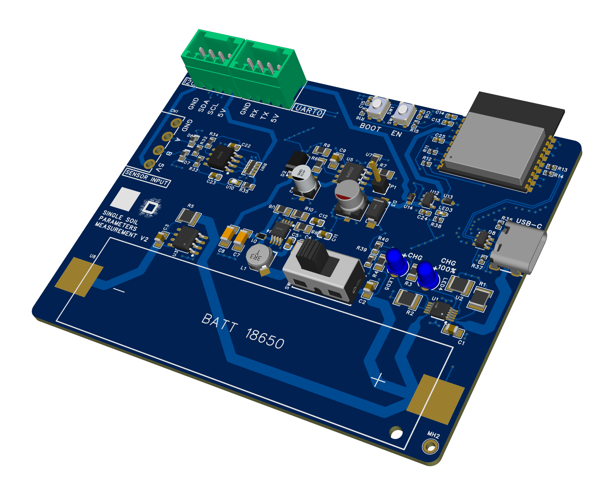

# Soil Parameter Measurement (single sensor)

> PCB design for an IoT Soil sensor monitoring prototype developed in EasyEDA Pro.

## Overview

This project presents the schematic and PCB layout of a prototype intended to [objetivo concreto del sistema].

The design integrates [microcontroller], [sensor(es)], [communication module] and [power source/regulator].

## My contribution

- Schematic capture in EasyEDA Pro
- Component selection and footprint assignment
- PCB layout
- Bill of materials preparation

## PCB design

| Schematic | PCB layout |
|---|---|
|  |  |

## Project status

**Design and PCB fabrication completed. Assembly, firmware bring-up, and physical validation are pending.**

## Planned next steps

1. Review the BOM availability and component substitutions.
2. Assemble and inspect the board.
3. Validate power rails before connecting the microcontroller.
4. Perform functional tests of sensors and communications.
5. Revise the design if required.

## Tools

- EasyEDA Pro

## License

This repository is for portfolio purposes. Do not manufacture or reuse the design without permission.
